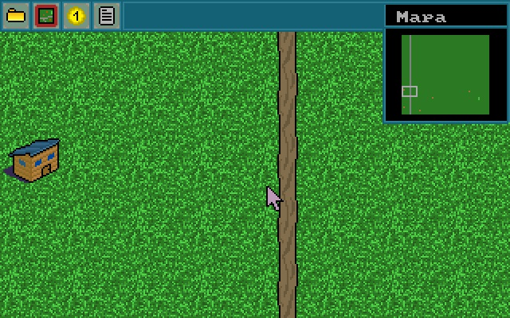
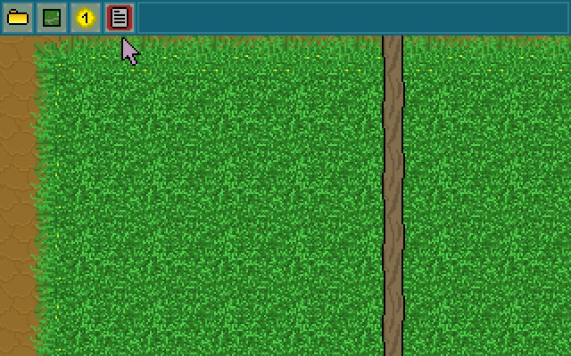
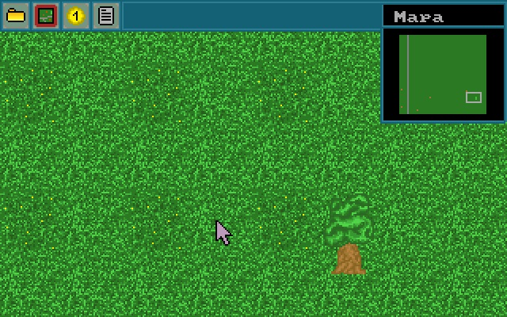
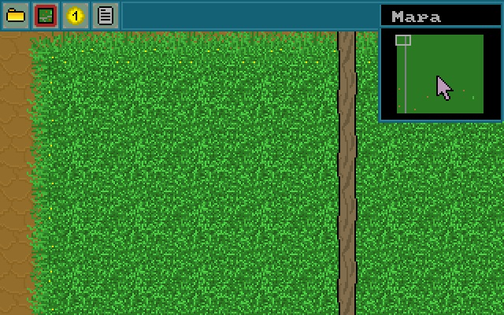

# Autokemp
My chidhood attempt to combine **Pascal** and **Assembler** to create a strategy game. Sources are most likely highly unoptimized but probably compilable. I am not sure :blush:

  
  

- Sources codes are in Czech language.
- Binaries can be run using [DOSBox](https://www.dosbox.com/)

# Features
- The game objects are saved in binary `obr` files.
- Game data are loaded from the external files.
- There is a minimap, several objects to place and easy way how to extend its list.
- The game supports scrolling.
- Maps are saved in my original format which is by coincidence quite similar to `RLE`.

# Screenshots

  
  

  

  

